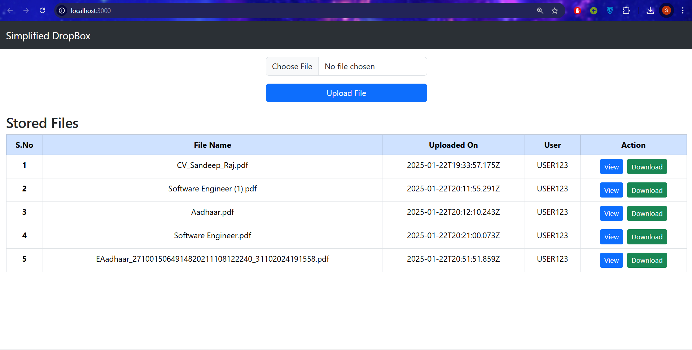

# Simplified DropBox

clone the repository to your local machine
```
git clone https://github.com/sandeeprajkanna/simplified_dropbox.git
```

## Starting Client

In the `client` folder, Use following commands for various tasks -

- Run `npm install` to install all the dependencies
- Run `npm start` to start the server in development mode [http://localhost:3000](http://localhost:3000)
- Run `npm test` Launches the test runner in the interactive watch mode
- Run `npm run build` Builds the app for production to the `build` folder.

## Starting Server

Create `.env` file in server folder, following environment variables are required to get started, see config file to get the whole list of env data.
- `NODE_ENV` Server environment
- `PORT` Server port
- `DB_URI` Database URL(MongoDB)
- `API_URL` URL of CLient App

```
Example: 
    NODE_ENV=development
    PORT=8000
    DB_URI=mongodb://localhost:27017/
    API_URL=http://localhost:3000

```


#### Setup

In `server` folder, Use following commands for various tasks -

- Run `npm install` to install all the dependencies
- Run `npm run dev` to run the dev server in watch mode
- Run `npm run build` to build the application
- Run `npm start` to start the server
- Run `npm run debug` to start the server in debug mode
- Run `npm run tslint` to run the linting

